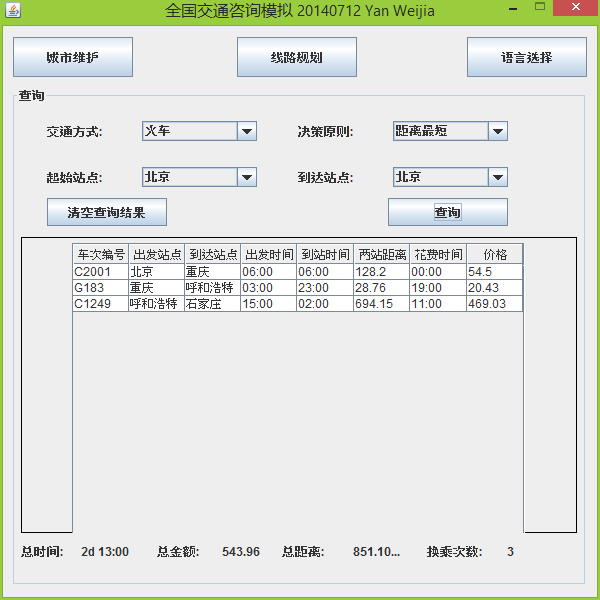
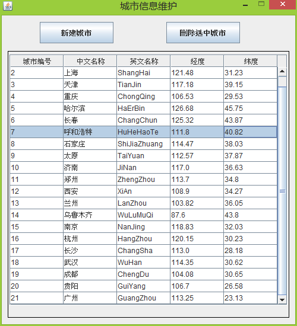
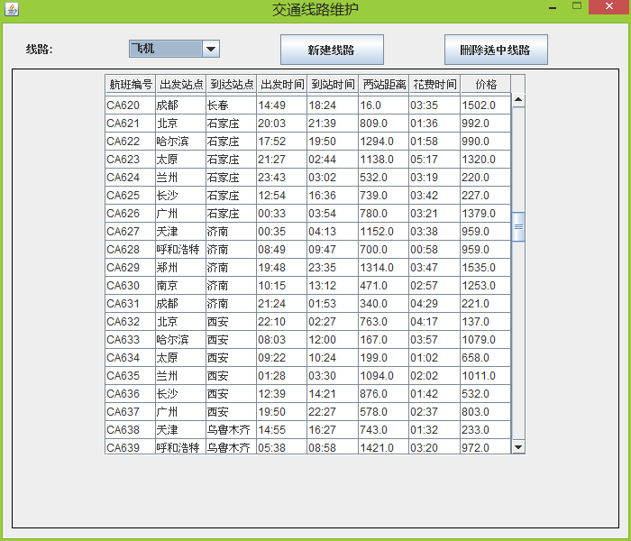
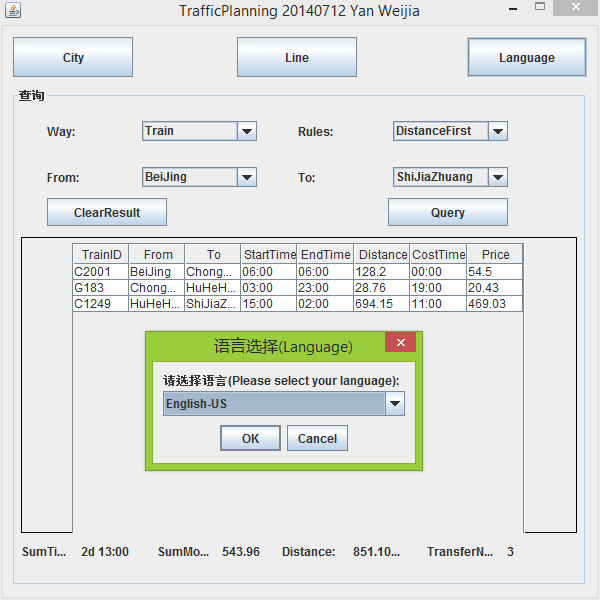
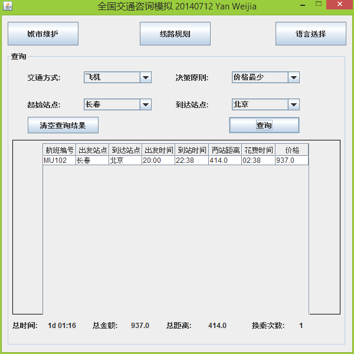

# TrafficPlanning(JAVA Swing)
A soft to planning traffic line / 最优线路规划
#####使用dijkistra算法计算
项目共有四个包,分别是
* cn.yanweijia.Appearance 可视化界面
* cn.yanweijia.dao 业务逻辑包含两个Bean:(City,Line) 和数据库操作DBHelper 时间日期类
* cn.yanweijia.Graph 图的算法,里面Graph.java文件是用来将城市和线路数据转换的,具体算法调用也在Graph.java里面,有详细注释,图采用的是三元组表示法.
* cn.yanweijia.Tools 里面有三个类,分别是 Config.java 配置文件,Debug.java调试日志类, Language.java多语言支持.

####线路数据等
在根目录下有trafficPlanning.sql文件,根据里面注释把数据库创建好,然后修改配置文件Config.ini里面的数据库连接url,用户名,密码.
火车_飞机_时刻表.xlsx表格只是当初随机生成数据用的文件,并没什么乱用
####多语言支持(not important)
默认支持中英文,需要可以自己在Language.java文件修改添加,然后自己单独写好配置文件 [语言_国家.ini]文件,如果文件被删除,Language.java提供了默认支持的中文

####如有问题还请邮件联系admin##yanweijia.cn(把##换乘@即可)
[风旋碧浪@严唯嘉 网站](http://www.yanweijia.cn)
####软件界面如下:

